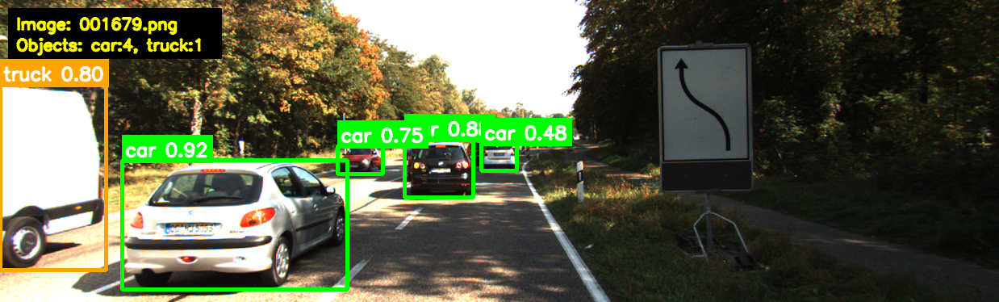
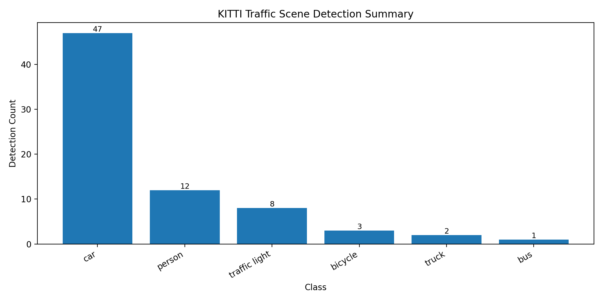
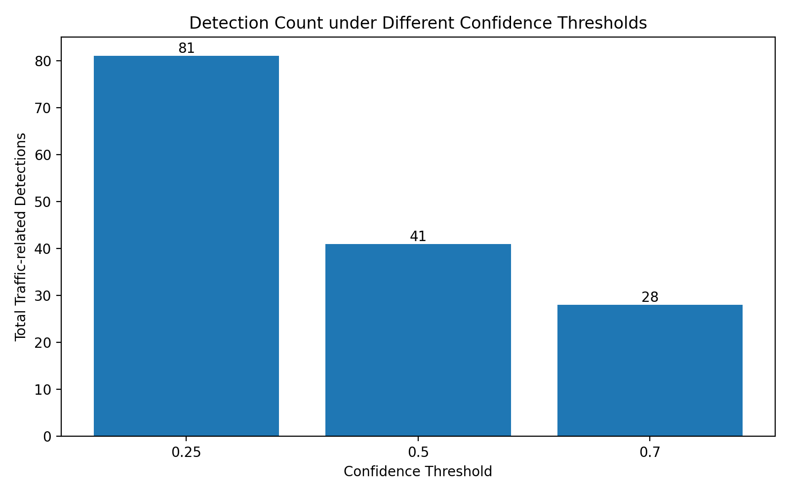
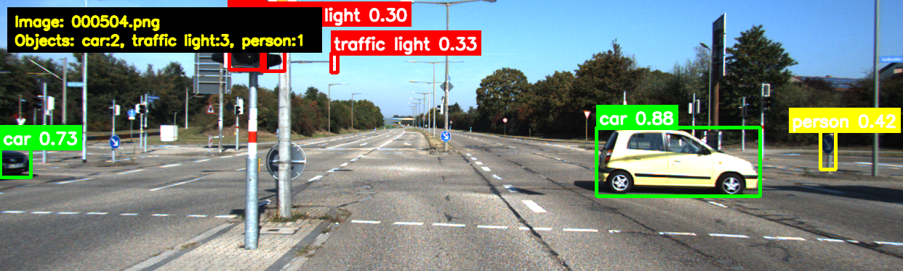

# KITTI YOLOv8 Object Detection Analysis

This project applies YOLOv8 to KITTI traffic-scene images for object detection and result analysis. The goal is to test a lightweight object detection model on autonomous driving scenes, export detection results, summarize class-level statistics, and analyze typical failure cases such as small objects, occlusion, distant vehicles, and false detections.

## Features

* Run YOLOv8 object detection on KITTI traffic-scene images
* Detect traffic-related objects such as cars, trucks, buses, bicycles, pedestrians, and traffic lights
* Save annotated detection images with bounding boxes and confidence scores
* Export detection results to CSV
* Generate per-image object count summaries
* Generate class-level detection statistics
* Visualize class distribution using a summary chart
* Identify possible failure cases using confidence, object size, and border-location indicators

## Tech Stack

* Python
* YOLOv8 / Ultralytics
* OpenCV
* Matplotlib
* KITTI Object Detection Dataset

## Project Structure

```text
kitti-yolo-detection-analysis/
├── data/
│   └── kitti_images/              # Local KITTI images, not uploaded
├── outputs/
│   ├── annotated_images/          # Generated detection images, not uploaded
│   ├── csv/                       # Generated CSV files, not uploaded
│   └── charts/                    # Generated charts, not uploaded
├── docs/
│   ├── kitti_detection_demo.png
│   ├── kitti_failure_case.png
│   └── kitti_class_summary.png
├── kitti_yolo_analysis.py
├── requirements.txt
├── .gitignore
└── README.md
```

## Dataset

This project uses images from the KITTI Object Detection Dataset.

Only a small subset of KITTI images is used for demonstration and analysis. The raw dataset images are not included in this repository. Users should download the KITTI dataset separately and place selected images into:

```text
data/kitti_images/
```

## How to Run

Install dependencies:

```bash
pip install -r requirements.txt
```

Put KITTI images into:

```text
data/kitti_images/
```

Run the analysis script:

```bash
python kitti_yolo_analysis.py
```

## Output Files

The script generates:

```text
outputs/
├── annotated_images/
├── csv/
│   ├── kitti_detection_results.csv
│   ├── kitti_image_summary.csv
│   └── kitti_class_summary.csv
└── charts/
    └── kitti_class_summary.png
```

## CSV Outputs

### `kitti_detection_results.csv`

This file stores object-level detection results.

| Column             | Meaning                                                                 |
| ------------------ | ----------------------------------------------------------------------- |
| image_name         | Image file name                                                         |
| class_name         | Detected object class                                                   |
| confidence         | YOLOv8 detection confidence                                             |
| x1, y1, x2, y2     | Bounding box coordinates                                                |
| center_x, center_y | Bounding box center point                                               |
| bbox_area_ratio    | Bounding box area divided by image area                                 |
| analysis_notes     | Simple notes such as low confidence, small object, or near image border |

### `kitti_image_summary.csv`

This file stores per-image object counts.

### `kitti_class_summary.csv`

This file stores total detection counts for each object class.

## Demo Result

### Detection Demo



This example shows YOLOv8 detection results on a KITTI traffic scene. The model detects several cars and one truck in a road scene.

### Class Summary



The class-level summary shows that cars are the dominant detected class in the selected KITTI image subset, which is consistent with typical road-scene data.

### Confidence Threshold Comparison



The confidence-threshold comparison shows how the total number of traffic-related detections changes under different confidence thresholds.

### Failure Case Example



This example shows potential limitations of YOLOv8n in complex traffic scenes, such as low-confidence detections, small objects, and possible false detections around traffic infrastructure or distant objects.

## Analysis Observations

In the selected KITTI image subset, cars are the dominant detected class, which is consistent with typical road-scene data. The confidence-threshold comparison shows that the number of detections decreases as the threshold increases. For example, the model produced 81 traffic-related detections at confidence 0.25, 41 detections at confidence 0.50, and 28 detections at confidence 0.70.

This indicates a trade-off between detection coverage and false-positive risk. A lower confidence threshold can detect more small or distant objects, but may also introduce more uncertain detections. A higher threshold produces more conservative results, but may miss small vehicles, distant traffic lights, or partially visible objects.

The failure-case candidate table uses heuristic indicators such as low confidence, small bounding-box area, and near-border object location. These candidates are not official KITTI benchmark errors, but they help identify examples that may require manual inspection.

## Limitations

The current analysis uses YOLOv8n, a lightweight detection model. While it is fast and easy to deploy, it may produce false detections or miss small and distant objects in complex road scenes.

Typical limitations include:

* Small or distant vehicles may be missed
* Traffic lights and signs may be detected with low confidence
* Background structures, poles, shadows, or reflections may cause false detections
* Objects near the image border may be only partially visible
* The current script performs inference only and does not calculate official KITTI benchmark metrics such as AP or mAP

## Future Work

* Add comparison with larger YOLOv8 models such as YOLOv8s or YOLOv8m
* Add confidence-threshold experiments
* Add manual failure case analysis
* Compare detection results with KITTI ground-truth labels
* Calculate detection metrics such as precision, recall, and mAP
* Extend the analysis to tracking or multi-frame video sequences
